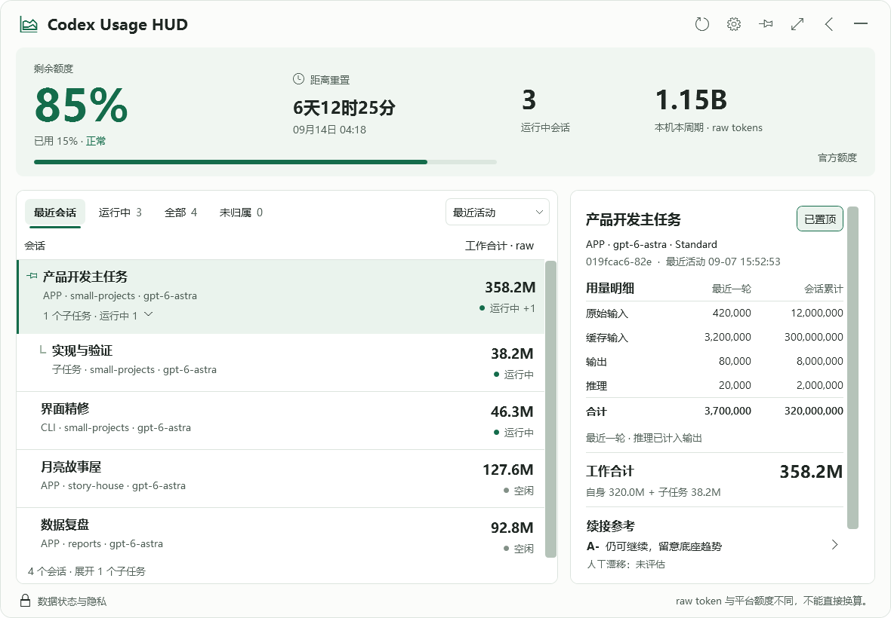
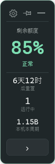

# Codex Usage HUD

> 一个运行在 Windows 桌面上的 Codex 用量、会话层级与长会话风险仪表盘。

[](LICENSE)
[](#系统要求)
[](#隐私边界)



<p align="center">
  
</p>

Codex Usage HUD 是一个非官方的 Windows 10/11 x64 本地伴侣应用。它把官方额度、
重置倒计时、APP/CLI 会话、子任务层级、raw token 统计和续接风险整理到一个可停靠、
可自动隐藏的桌面 HUD 里。

## 下载

不想编译代码时，直接前往
[Releases](https://github.com/captpascallv-dev/codex-usage-hud/releases/latest)
下载 `CodexUsageHUD-win-x64.zip`，解压后运行 `CodexUsageHud.App.exe`。
发布包自带 .NET 运行时，不需要安装程序或管理员权限。

Windows 可能因为应用尚未购买代码签名证书而显示 SmartScreen 提示。Release 同时提供
SHA-256 校验文件，用于确认下载内容没有发生变化。

### v1.0.2 父子 lineage 去重

Fork / 子任务 rollout 会把祖先 token 历史复制到新的 thread id 下。v1.0.1 按 thread
指纹去重，因此同一语义事件会被每个后代再计一次。v1.0.2 保留原始 thread 指纹与
`token_samples` 供审计，同时按 `(解析后的父树根, 语义事件身份)` 只保留最早可靠出现；
会话累计只含本线程的 canonical 事件，父工作合计含子孙 canonical 事件，全局/周期合计
每个 canonical 事件只计一次。新事件的语义身份是全部七个独立 total/last/context 字段
（`input`、`cached_input`、`cache_read_input_tokens`、`cache_write`、`output`、
`reasoning`、`total`，外加 last 元组与 context-window 有无），缺失与显式零不相同，
不先做 canonical 归一；schema v9 迁移行使用确定性遗留别名，使等价
的后续 live 祖先回放与迁移结果一致，但不会把共享同一损失别名的不同 live 缺失/零
事件全部消掉。兼容配对只绑定遗留组赢家与至多一个 live v2 身份，被降级的代表
在后续写入、重启和全量重建后仍可被发现，因此第二个不同的缺失/零身份保持
canonical。同一插入上的精确组选举与兼容配对只按净 canonical 变化更新合计；既提升
又降级的样本不对合计产生净增减。会话元数据合并在省略 `parent_thread_id` 时保留已有父链；显式
`ClearSessionParent` 才是清父路径。缺失或成环的 `parent_thread_id` 保持为孤立根，不按名称、
项目或时间推断。

### v1.0.1 额度刷新修复

Codex App Server 现会同时返回名为 `primary` 与 `secondary` 的额度窗口。v1.0.0 因无法
唯一选择主窗口，会在旧窗口到期后持续显示陈旧数据。v1.0.1 只按官方稳定桶标识选择
`primary`，并把已经到期且无法更新的旧观测显示为“不可用”，不再保留过期百分比。

## 核心功能

- 显示 Codex 官方剩余额度、重置时间与倒计时；接口不可用时明确显示陈旧或不可用。
- 汇总本机当前额度周期的 raw token，但从不把 raw token 换算成平台额度或费用。
- 区分 APP、CLI、子任务和未归属历史，并按真实 `parent_thread_id` 展示父子层级。
- 展示运行状态、最近会话、全部会话、活动排序、token 排序和会话置顶。
- 提供结构承载、同模型长会话风险、人工漂移标记与可解释的续接建议。
- 支持左侧、右侧和顶部停靠，9 像素自动隐藏把手、托盘、始终置顶和开机启动。
- 单实例运行；再次启动会唤回现有窗口，不会启动第二个数据库写入进程。

## 隐私边界

- 完全本地运行，不上传遥测，不做云同步。
- 只读取白名单内的 Codex 本地元数据和本地 App Server 的只读额度方法。
- 不读取或保存 prompt、response、Cookie、浏览器数据、`auth.json` 或其他凭据。
- 应用数据库默认位于 `%LOCALAPPDATA%\CodexUsageHUD\usage.db`。
- HUD 只观察 service tier，绝不修改 Standard、Fast 或其他运行设置。

完整数据边界与算法见 [技术规格](docs/TECHNICAL_SPEC.md)。

## 参与项目

- 使用问题或功能建议：提交 [Issue](https://github.com/captpascallv-dev/codex-usage-hud/issues)。
- 希望修改代码：Fork 仓库并提交 Pull Request。
- 安全或隐私问题：请按 [SECURITY.md](SECURITY.md) 私下报告，不要公开粘贴日志或会话数据。
- 贡献步骤与验证要求见 [CONTRIBUTING.md](CONTRIBUTING.md)。

维护者可以在 Pull Request 中查看差异、讨论、要求修改，并选择合并或关闭。所有贡献都必须
继续满足本项目的本地只读、无正文、无凭据、无遥测边界。

## English summary

Codex Usage HUD is an unofficial, privacy-first Windows companion for local Codex usage.
It shows official quota windows, APP/CLI session hierarchy, raw-token metadata, running
state, and explainable continuation-risk guidance. It runs locally, reads only allowlisted
metadata, and never collects prompts, responses, credentials, cookies, or browser data.
Download the ready-to-run Windows package from
[Releases](https://github.com/captpascallv-dev/codex-usage-hud/releases/latest), or build
the source with the project-local scripts below.

## 系统要求

- Windows 10/11 x64
- 使用成品 ZIP：无需单独安装 .NET
- 从源码构建：PowerShell 与 .NET SDK 8.0.423；也可把 SDK 放在 `.tools\dotnet`

---

## 详细使用

1. 解压 `CodexUsageHUD-win-x64.zip`。
2. 双击 `CodexUsageHud.App.exe`。发布包自带运行时，不需要另外安装 .NET。
3. 启动后先显示靠边的紧凑仪表卡；点击卡片主体或底部箭头展开完整面板，齿轮打开设置，
   图钉切换窗口置顶。展开页右上角箭头收回，全屏按钮可在工作区全屏与原窗口大小之间切换。
4. 紧凑卡可拖到桌面左、右或上边缘。程序同时依据鼠标与卡片位置识别停靠意图，左右侧
   不要求把卡片边缘精确拖进很窄的命中区。停靠后自动隐藏，只保留约 9 像素状态把手；鼠标移入
   会自动唤出。右边向左展开、左边向右展开、顶部向下展开。
5. 设置面板可切换始终置顶、靠边自动隐藏、随 Windows 登录启动，并可创建/修复桌面快捷方式。
   窗口关闭按钮只隐藏到系统托盘；从托盘菜单选择“退出”才会彻底结束。
6. Windows 可能把托盘图标放进右下角的 `^` 隐藏区；如果一时找不到，再双击同一个 EXE
   或桌面快捷方式，会唤回已经运行的紧凑卡，不会重复启动后台。
7. 发布包是便携版，不需要安装；移动 EXE 后重新运行一次即可修复已启用的开机启动路径。

竖向和顶部紧凑卡都显示官方剩余额度、运行中会话数、本机当前额度周期 raw token 和重置倒计时，
并都提供窗口置顶按钮。置顶后，自动隐藏留下的 9 像素把手仍位于网页等普通前台窗口之上。
展开面板提供“运行中 / 最近会话 / 全部 / 未归属历史”导航、按活动或 token 排序、
APP/CLI 来源标记、可展开的子任务层级，以及最近一轮与会话累计明细。父会话同时显示
自身 token、所辖子任务 token 与工作合计；全局和本额度周期总量仍按每个 thread 只计一次。
选中会话还显示结构承载、长会话风险、人工漂移状态和六档综合
续接建议；不显示或使用当前上下文占用及压缩次数。会话名称是主标题，
thread ID 是次级识别信息。颜色仅表达
正常、低于 20%、低于 10% 和数据不可用。应用无
代码签名，因此 Windows 可能显示 SmartScreen 提示；校验包旁的 SHA-256 文件
可确认下载内容未变化。

## Data boundary

The runtime resolves `CODEX_HOME` when set, otherwise `%USERPROFILE%\.codex`.
It reads only `sessions/**/*.jsonl`, `archived_sessions/**/*.jsonl`, the
allowlisted metadata columns in `state_5.sqlite`, `session_index.jsonl`, the
local Codex executable, and its App Server protocol. The optional pet adapter
is not included in this MVP, so `.codex-global-state.json` is not opened.
Credentials, cookies, environment secrets,
browser storage, and unrelated projects are outside the reader.

The default app database is `%LOCALAPPDATA%\CodexUsageHUD\usage.db`; settings
always show that literal symbolic path, never its resolved private path. The app
log contains only safe error codes, relative source paths, offsets, and
timestamps. Test, diagnostic, package-smoke, and migration fixtures use fresh
project-local databases and never open the user's real HUD database.

When login startup is enabled, the app owns exactly one current-user registry
value: `HKCU\Software\Microsoft\Windows\CurrentVersion\Run\CodexUsageHUD`.
Its value is only the quoted EXE path plus `--autostart`; it contains no Codex
data or credentials and can be removed from the tray menu.

## Token numbers

Each accepted `event_msg/token_count` needs both the cumulative snapshot and
the latest model-call increment. A global SHA-256 fingerprint includes the
thread, both snapshots, schema version, and context window. Timestamp, path,
and byte offset are deliberately excluded, so replay, copy, archive rotation,
and restart do not add the same event twice. `total_token_usage` is never
summed and is never an admission frontier: concurrent branches can interleave
cumulative observations. Every first-seen full tuple contributes its
`last_token_usage` exactly once; only an exact full-tuple replay adds zero.

Databases created by the earlier monotonic-frontier build are migrated once by
resetting app-owned source offsets to zero and rescanning. Existing
fingerprints and samples remain in place, so exact replay stays idempotent and
previously rejected unique interleaved tuples are recovered.

Private-source migration and physical byte scrubbing are separate durable
states. The logical rewrite commits `logical_complete` together with a pending
scrub marker; only checkpoint/TRUNCATE, `VACUUM`, and a second checkpoint may
commit the scrub as complete. A hard process stop at any boundary is retried on
the next open without deleting accepted samples, fingerprints, totals, or
source state.

Each sample also retains its safe source identity, source generation, and
complete-line byte offset. On Windows the trusted source identity uses the
volume serial plus the 128-bit `FILE_ID_INFO` value. In degraded mode, path and
creation time are used only transiently to derive a SHA-256 fallback digest;
the path itself is never persisted. Length and last-write observations
distinguish append, move, truncate, replacement, and same-length rewrite.
Implicit task turns use deterministic safe metadata keys, so a copied archive
does not inflate the turn sequence or erase the latest-turn total.

Schema v7 makes SQLite the single scan authority: source expectation, event
acceptance, structural ordering, session state, latest-event evidence,
aggregates, diagnostics, and cursor progress commit together. A failed, busy,
or revision-conflicted transaction publishes no cache progress. Upgrade from a
legacy database rewrites degraded source identities to opaque keys, preserves
accepted fingerprint/sample values, scrubs legacy path bytes, and rebuilds
derived aggregates in restart-safe batches of at most 2,000 samples. Rollout
commits remain frozen during that rebuild.

The current schema is v10. V8 added the metadata-only manual drift assessment;
v9 adds only normalized `session_surface`, `parent_thread_id`, and bounded
`agent_depth` fields for APP/CLI labels and subagent hierarchy. v10 keeps those
hierarchy fields and adds lineage identity, alias, root, and canonical flag
columns on `token_samples`. Raw source JSON is never copied into the HUD
database.

Turn/source migrations reset source cursors and rebuild derived aggregates from
accepted samples. A subsequent exact replay may fill only missing safe
turn/source metadata. That recovery updates only the affected turn aggregate
and recomputes the thread's latest-event row; it never contributes tokens again
or advances activity, session state, frontier, bucket, or cycle data.

The displayed components are related, not additive columns:

- `cached input = max(cached_input_tokens, cache_read_input_tokens)`;
- `raw input = max(input_tokens - cached input, 0)`;
- `output = output_tokens`, including reasoning output;
- `reasoning = reasoning_output_tokens`, a subset of output;
- `canonical total = input + output` with checked/saturating arithmetic.

Cache-write input is retained as metadata but is not added to canonical total.
Raw token and platform quota are different units and cannot be converted.

“运行中”只统计当前状态为 `Running` 的会话；最近 15 分钟活动过但已经空闲的
会话不会计入。展开页的“运行中会话本额度周期合计”按这些线程与官方当前窗口
同时过滤 token 样本，不是这些会话的全历史累计。“本额度周期全部会话合计”则
使用同一官方窗口统计所有可见会话。

“最近会话”是按本地最近活动排序的非内部会话，最多显示 30 条；它不冒充 Codex
左侧栏的“当前会话”，因为现有只读元数据不能可靠证明侧栏焦点。“全部”只显示
当前 `CODEX_HOME` 可见的主会话；来源 `vscode`/App Server 归一化显示为 `APP`，来源
`cli`/`exec` 归一化显示为 `CLI`。这表示启动入口，不代表产品侧栏焦点，也不尝试区分
Codex 与 GPT Work 的产品形态。明确标记为 `subagent` 且父 thread 仍可见时，会按
`parent_thread_id` 嵌套到所属主会话或上级子任务下；父行的“工作合计”是自身累计加全部
后代子任务累计。子任务自身仍是独立 thread，因此全局、本额度周期和数据库统计不会再把
工作合计重复相加。父记录已经不可用、旧版本没有父 ID 或父链异常的子任务，只出现在
“未归属历史”。纯 Chat 没有 Codex rollout 时自然不会出现；其他 `CODEX_HOME` 的会话也
不会自动并入当前实例。

### 续接风险参考

- `压缩后底座` 优先使用 rollout 中官方明确的
  `event_msg.payload.type=context_compacted` 完成边界，并取该边界后同一来源的第一条可靠非零
  `token_count`。只有明确边界缺失时，才降级使用可靠、同一 turn、十分钟内的
  “高占用 → 零用量标记 → 明显降低的下一次非零输入”序列。
- 比较严格限定在同一模型、同一 context window 内；模型或窗口改变后重新积累样本。
  至少三个同口径样本才显示判断。底座取最近三次的中位比例，`底座趋势` 是最近一次与三次中
  最早一次的百分点变化。
- `续航参考` 比较相邻压缩边界间的可靠 turn 数和首次接受的 model-call raw token；界面分别
  表述为“回合”和“间隔 token 续航”。后者是压缩间隔内观测到的 raw token 处理量，不是官方
  上下文容量或平台额度。它只比较同一会话自身趋势，不提供跨会话通用绝对阈值。
- `结构承载` 分为 `S / A+ / A- / B+ / B- / C` 六档。底座依次按 `<25%`、`25%–<35%`、
  `35%–<45%`、`45%–<55%`、`55%–<65%`、`>=65%` 定基础等级。底座趋势在 `±3` 个百分点
  内视为稳定，明显上升或下降最多修正一级。回合和间隔 token 续航都达到 `±20%` 时才共同
  修正；一好一坏显示“续航信号分化”且不改等级。趋势优先于续航，结构等级相对底座最多偏移一级。
- `长会话风险` 自动组合会话累计 raw token、已聚合回合数以及最近 48 小时的 token/回合强度，
  只和本机至少 10 个同模型主会话作相对比较。raw token 不单独定级；历史量和回合量同时进入
  本机前 10% 且显著高于中位数时至少给出 `B+` 风险，下探到前 3% 且两项均超过中位数 10 倍时
  至少给出 `B-`。这表示长期承载风险，不声称已经遗忘内容。
- `实际漂移` 无法从 token 元数据判断。用户可为选中会话选择 `未评估 / 偶发漂移 / 连续明显漂移`：
  偶发漂移使综合建议最低为 `B-`，连续明显漂移使其为 `C`。HUD 只保存 thread id、档位和标记时间，
  不保存原因或任何对话正文；`未评估` 不等于零漂移。
- 综合建议取结构承载、长会话风险、人工漂移三项中最差的一项，不做平均。`B+` 表示仍可继续但
  建议准备续接，`B-` 表示当前完整工作包结束后续接，`C` 表示尽快续接且不再开启新的大型工作包。
- Codex 自身已经显示当前上下文进度并自动压缩，因此 HUD 不重复显示“是否临近压缩”；压缩
  次数也不显示、不参与判断。压缩频繁本身不等于应该换会话。
  HUD 不读取正文，所以不会自动判断漂移，也不会自动创建或切换会话。
- 首次升级只回填当时仍存在于 `sessions` 或 `archived_sessions` 的 JSONL。已经被移动或删除的
  旧日志不会被猜算；对应会话可能继续显示“样本不足”。

## Quota source

Quota is requested through a short-lived local child using exactly:

```text
codex -s read-only -a untrusted app-server
```

The app sends `initialize` and `account/rateLimits/read` over JSON-RPC with
bounded timeouts. It selects a stable main bucket by id/name, computes
remaining percentage from the official `usedPercent`, and calculates the
cycle start from `resetsAt - windowDurationMins`. A non-positive official
window duration is rejected as unavailable rather than coerced or guessed. A failure is shown as
unavailable. The last valid official observation may be shown only as stale;
raw tokens never estimate quota. A large increase is labeled only `疑似 reset
信号`. Official quota polling is every 60 seconds plus manual refresh. A
temporary failure shows the last valid official observation only as
`本机最后观测/陈旧`, or `不可用` when none exists.

The displayed service tier has persisted provenance. Ordered rollout evidence
is `rollout-explicit`; prior non-empty values migrate as `legacy-preserved`;
model-catalog inference is `catalog-default`; otherwise it is unavailable.
Precedence is rollout-explicit, legacy-preserved, catalog-default, then
unavailable. The HUD observes this value and never changes runtime service.

## Controls

The borderless window starts as an Edge Beacon compact card. Both vertical and
top layouts expose quota, countdown, running count, and local-cycle raw total.
The former decorative ellipsis is a real settings button. Both compact layouts
also expose the same persisted window-topmost toggle as the expanded header. The card can be dragged,
kept on top, docked to the left/right/top work-area edge, and auto-hidden to a
9-pixel recovery handle. Pointer-at-edge intent supplements window-edge distance,
so left and right docking do not require pixel-perfect placement. Hover reveals the card; its expand button opens the
full panel away from the docked edge. The panel and compact card remember their
safe screen position and recover after display-topology changes. Closing hides
the HUD to the tray. The tray provides show/hide, refresh, settings, desktop
shortcut creation/removal, login-start, and explicit exit. If Windows places
the tray icon in notification-area overflow, launching the same EXE again
signals the existing process and restores the compact card.

Expanded mode provides running/recent/all/orphan-history navigation,
token/activity sort, APP/CLI source labels, expandable parent/child task hierarchy,
and safe role/nickname/project/model/tier/status metadata,
recent and session-total components, running-session current-cycle/all-session
cycle aggregates, quota freshness, and recent safe quota/reset/source events.
Parent work totals combine that parent's own total with each linked descendant
exactly once for display; global and cycle aggregates continue counting each
thread exactly once. Subagents whose parent metadata is unavailable remain in
the orphan-history view instead of being attached by guesswork.
Conversation name is primary and thread ID is secondary. Project remains a
column but the ineffective project-group toggle was removed. A reliable
explicitly pinned session is always placed first; all unpinned rows then obey
the selected activity or token order. Session pinning is independent of the
window's always-on-top setting. A reliable
associated turn is labeled `最近一轮`; a
token event without a reliable turn is labeled `最近事件（降级）`; no evidence is
`不可用`. The five recent-value columns use the `最近统计·` prefix. The
expanded header also provides a reversible work-area fullscreen mode. Fullscreen
widens and scales the detail pane for readability; restoring returns to the exact
previous expanded bounds. Collapsing a docked auto-hidden panel returns directly
to its preserved 9-pixel edge handle instead of using the expanded-window position.
Mouse clicks on the window-topmost control update its active border immediately.
The one-second countdown performs no I/O;
rollout append passes run every 8 seconds, metadata/discovery about every 30
seconds, and unchanged sources are skipped before parsing. File-system change
signals prioritize active or reactivated logs on the next pass; periodic
discovery remains the recovery path for missed signals and rotation.

The first schema-v5 launch may show `索引中（统计迁移）` while app-owned samples
are rebuilt into derived aggregate tables in bounded background batches. The
HUD frame—including rollout, quota, aggregate, and recent-event reads—is built
off the WPF dispatcher; the dispatcher only applies the immutable frame and
runs the one-second no-I/O countdown.

Recurring frames read turn totals only for each session's current turn and the
latest reliable event turn. The composite turn key supplies point lookups, so
historical turn cardinality does not expand the recurring read. Startup opens
the instance gate, database, engine, and privacy log on a worker. Settings,
pinning, and log writes share one bounded FIFO worker queue; explicit Exit
rejects new queue work, waits retained refresh tasks, writes final settings,
drains the queue, disposes runtime resources once on a worker, and only then
shuts down WPF.

The first schema-v7 launch resets only app-owned rollout offsets once so the
allowlisted `context_compacted`, model, context-window, and safe ordering
metadata can be backfilled. Existing fingerprints, token samples, and
aggregates remain authoritative, so exact replay enriches metadata without
adding tokens again. Until three comparable observations exist, the context
card shows `样本不足` instead of guessing.

Single-instance ownership is enforced by holding
`%LOCALAPPDATA%\CodexUsageHUD\instance.lock` with `FileShare.None` for the
process lifetime. Contention never opens a second database/log writer; it sends
one show-card signal over a current-user-only named pipe whose name contains
only a hash of the app data directory. If the signal cannot be delivered, the
second launch shows a recovery instruction instead of disappearing silently.
Unsafe reparse paths and lock I/O failures stop with a safe gate code.

The tray menu also exposes a checked `随 Windows 登录启动` item. It writes only
the current-user Run value and requires no administrator rights. If the EXE is
moved, launching it manually once repairs an existing HUD startup registration
to the new executable path.

Saved positions are accepted only when a usable part of the compact card or
its recovery handle remains on a
connected display. Display-topology changes and external-activation restores
recheck the live monitor working areas and move an inaccessible card to the
primary display without changing its persisted always-on-top choice.

The one-second countdown updates only bound time values. The compact card uses
opaque cached surfaces and no continuous animation, so keeping the HUD visible
does not continuously re-rasterize the complete window.

## Build and verify

The project pins .NET SDK 8.0.423 in `global.json`. Scripts prefer an SDK under
`.tools\dotnet` and otherwise use the matching system SDK. CLI state and the NuGet
cache remain project-local under `.tools`; scripts disable CLI telemetry and do not
change machine PATH or registry.

```powershell
.\scripts\build.ps1
.\scripts\test.ps1
.\scripts\correction-04-check.ps1
.\scripts\refresh-diagnostic.ps1
.\scripts\quota-check.ps1
.\scripts\real-session-check.ps1
.\scripts\source-hierarchy-check.ps1
```

`source-hierarchy-check.ps1` reads only the same allowlisted local metadata used by the HUD and reports
aggregate APP/CLI/internal/linked/orphan counts. It does not print names, thread IDs, cwd values, or raw source JSON.

The automated V2 interaction suite also mounts a real WPF window with 1,000
synthetic sessions, exercises navigation and sorting, performs 30 repeated
collapse/expand pairs, coalesces 30 rapid refresh requests, and verifies the
left/right/top docking plus the 9-pixel reveal handle. This is separate from
the screenshot comparison: visual QA proves appearance; the WPF stress test
proves the implemented controls remain responsive.

The complete suite currently contains 84 checks, including source classification,
parent/child rollup without double counting, implemented root-scoped lineage
deduplication, cycle/orphan isolation, official compaction-boundary capture,
same-model/window segmentation, baseline/runway trend calculations,
metadata backfill without token duplication, restart persistence, fallback
false-positive rejection across turn boundaries, and absence of current-context
or compression-count UI.

The real-session command defaults to two synthetic Correction 04 rollout
threads and a fresh timestamped project-local database. It uses an independent
explicit numeric-tuple set rather than the production fingerprint function,
compares every approved component and count, then reopens and rescans to verify
totals, sample/fingerprint counts, and complete offsets remain unchanged. An
explicit `-CodexHome` is reserved for later Lead-controlled local acceptance;
this source implementation does not open the user's real HUD database.

`scripts/publish.ps1` creates a self-contained single-file Windows x64 build,
copies this README and a package-safe acceptance summary, rejects machine paths
or stable local session identifiers, writes an internal SHA-256
manifest, launches the executable against an isolated project-local data
directory, creates the ZIP and sidecar hash, extracts it again, and verifies
both manifests. The smoke launch is off-screen and never opens the user's real
HUD database.

## Known limits

- The HUD reports only sessions present in local Codex metadata/logs; deleted
  or unavailable local history cannot be reconstructed.
- Recent parent/subagent logs on this installation do not share token tuples.
  Some other Codex versions may copy parent history into a child rollout. v1.0.2
  implements root-scoped lineage deduplication: raw thread fingerprints stay
  durable for audit, while consumption uniqueness is `(parent-tree root, seven-field
  semantic identity)` including `cache_read_input_tokens`, with missing distinct
  from explicit zero. Missing or cyclic `parent_thread_id` values stay isolated
  roots and are never inferred from name, project, or time.
- The application is Windows x64 and unsigned. It does not estimate money,
  billing, or platform quota from raw tokens.
- Login startup occurs after the current user signs in to Windows; it does not
  run before login and does not bind the HUD lifecycle to Codex.
- The current allowlisted local metadata cannot reliably separate Codex from
  GPT Work or reproduce the exact Codex sidebar/focus state, so those claims
  are deliberately not shown.
- The continuation reference is metadata-only. It cannot prove that an old
  decision was forgotten or that a handoff will preserve every detail. It becomes
  unavailable if Codex changes the compaction/token event shape, if model/window
  evidence is missing, or if fewer than three comparable observations exist.

## Removing app-owned data

First clear `随 Windows 登录启动` from the tray menu, then Exit the HUD and remove
`%LOCALAPPDATA%\CodexUsageHUD` if its local history, settings, and app-owned log
should be deleted. Do not remove or edit Codex source data to reset the HUD.
